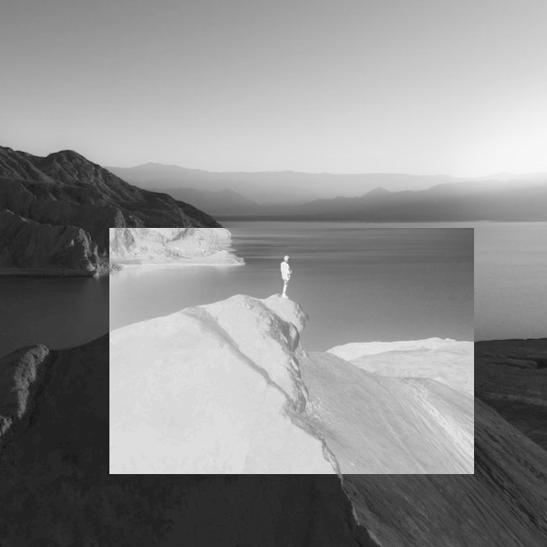

= Processamento Digital de Imagens
Francisco Paiva da Silva Neto - paiva.neto.067@ufrn.edu.br
:toc: left
:allow-uri-read:
:imagesdir: ./imagem

== 1. Manipulando pixels em uma imagem

=== Exercício 1.1 (Negativo da imagem)
O exercício do negativo da imagem consiste em calcular o negativo da imagem, ou seja, calcular o seu complemento de forma a obter uma imagem com cores invertidas, sendo que
no nosso caso esse efeito será realizado em imagens com escala de cinza, visto que o tratamento será feito em apenas um canal, embora a imagem usada como entrada do programa 
possa ser colorida.

Vale ressaltar que o filtro do negativo é uma transformação na imagem que é muito utilizada para realçar detalhes em imagens com alto contraste dando enfoque em elementos específicos
de acordo com as necessidades do usuário, valendo salientar que essa operação não preserva totalmente a qualidade da imagem, podendo ser calculada como:

pixel_atual = 255 - pixel_atual (aplicada pixel a pixel)

A fórmula acima é explicada visto que as iamgens as quais trabalhamos são compostas por pixels representados cada um por 1 byte (8 bits), podemos ter 256 tons de cinza diferentes (0 a 255), 
logo, o código abaixo demonstra como usar o OpenCV para realizar essa operação com uma condição que apenas calcula o negativo se as coordenadas para dois pontos P1 e P2 inseridas pelo usuário estiverem nos limites 
da imagem formando assim a região retangular que será aplicada o filtro.

[source, cpp]
----
.negativo.cpp
#include <iostream>
#include <opencv2/opencv.hpp>

int main(int, char** argv){
  cv::Mat image;
  int pixel_x1, pixel_y1, pixel_x2, pixel_y2, height, width;

  image= cv::imread(argv[1],cv::IMREAD_GRAYSCALE);
  if(!image.data)
    std::cout << "nao abriu " << argv[1] << std::endl;

  cv::namedWindow("Janela", cv::WINDOW_AUTOSIZE);

  width = image.cols; //CAPTURA LARGURA DA IMAGEM
  height = image.rows; //CAPTURA ALTURA DA IMAGEM

  std::cout << "Tamanho da imagem: " << width << " x " << height << std::endl;

  std::cout << "Digite as coordenadas do ponto 1:" << std::endl;
  std::cin >> pixel_x1 >> pixel_y1;
  std::cout << "Digite as coordenadas do ponto 2:" << std::endl;
  std::cin >> pixel_x2 >> pixel_y2;

  if (pixel_x1 >= 0 && pixel_x2 <= width) {
    if (pixel_y1  >= 0 && pixel_y2 <= height) {

      cv::imshow("Imagem original", image);  
      cv::waitKey();

      for(int i=pixel_x1;i<pixel_x2;i++){
        for(int j=pixel_y1;j<pixel_y2;j++){
          image.at<uchar>(i,j) = 255 - image.at<uchar>(i,j);
        }
      }

  cv::imshow("Imagem negativa", image);  
  cv::waitKey();
    }
  }
  else {
    std::cout << "Coordenadas invalidas" << std::endl;
  }

  return 0;
}
----

O código acima captura inicialmente as dimensões da imagens salvando nas variáveis "width" e "height", largura e altura, rescpectivamente, e logo após pede ao usuário as coordenadas 
dos pontos P1 e P2 assumindo que o ponto P1 seja anterior ao ponto P2 horizontalmente e verticalmente, caso contrário, após isso, há um trecho do código aonde acontece uma verificação 
da validade das coordenadas, retornando a mensagem "Coordenadas invalidas" em caso de P1 > P2, encerrando o programa, como pode ser visto nos trechos de código abaixo.

[souce, cpp]
----
if (pixel_x1 >= 0 && pixel_x2 <= width) {
    if (pixel_y1  >= 0 && pixel_y2 <= height) {

      cv::imshow("Imagem original", image);  
      cv::waitKey();

      for(int i=pixel_x1;i<pixel_x2;i++){
        for(int j=pixel_y1;j<pixel_y2;j++){
          image.at<uchar>(i,j) = 255 - image.at<uchar>(i,j);
        }
      }

  cv::imshow("Imagem negativa", image);  
  cv::waitKey();
    }
  }
----

Acima a parte referente ao cálculo do negativo com um laço duplo que varre toda a região demarcada pelo usuário realizando o cálculo do valor novo de cada pixel de acordo com a fórmula citada
anteriormente, denotada no código pelo comando 
[source, cpp] 
----image.at<uchar>(i,j) = 255 - image.at<uchar>(i,j);----
, mostrando a imagem logo após e esperando o usuário apertar alguma tecla
para encerrar o programa.

[source, cpp]
----
  else {
    std::cout << "Coordenadas invalidas" << std::endl;
  }

  return 0;
----

Caso as coordenadas sejam inválidas é exibida a mensagem acima e logo após o programa é encerrado ao sair do laço condicional.

==== Resultados
Para os resultados, foi inicialmente dado entrada com uma figura denominada "pexels.png" de tamanho 600 x 600 px colorida que foi aberta em escala de cinza usando o comando [source, cpp] ----image= cv::imread(argv[1],cv::IMREAD_GRAYSCALE);----.

[[fig_pexels, pexels]]
.pexels

Abaixo o resultado do código com P1 = (250, 120) e P2 = (520, 520):

=== Exercício 1.2 (Troca de regiões)
No exercício da troca de regiões, o objetivo é permitir que o usuário entre com uma imagem (preferencialmente quadrada) e divida a imagem em quatro quadrantes trocando-os de forma que o primeiro vire o quarto, o quarto o primeiro, o segundo vire o terceiro e o terceiro vire o segundo, 
fato esse que será útil na hora de estudar filtros no domínio da frequência, que serão abordados mais adiante no tópico dos defeitos periódicos.

Logo, o código abaixo mostra como funciona o programa usando a divisão da imagem em quadrantes de forma que seja feita a troca mencionada acima.

[source, cpp]
----
#include <iostream>
#include <opencv2/opencv.hpp>

int main(int, char**){
  cv::Mat image, translated_image;
  cv::Mat img_q1, img_q2, img_q3, img_q4, sup_img, inf_img;
  int height, width;

  image= cv::imread("pexels.png",cv::IMREAD_GRAYSCALE);
  if(!image.data)
    std::cout << "nao abriu pexels.png" << std::endl;

  width = image.cols;
  height = image.rows;

  cv::namedWindow("Janela", cv::WINDOW_AUTOSIZE);
  
  cv::imshow("image original", image);  
  cv::waitKey();

  img_q1 = cv::Mat(image, cv::Rect(0, 0, image.cols/2, image.rows/2));
  img_q2 = cv::Mat(image, cv::Rect(image.rows/2, 0, image.cols/2, image.rows/2));
  img_q3 = cv::Mat(image, cv::Rect(0, image.cols/2, image.cols/2, image.rows/2));
  img_q4 = cv::Mat(image, cv::Rect(image.rows/2, image.cols/2, image.cols/2, image.rows/2));

  cv::hconcat(img_q4, img_q3, sup_img);
  cv::hconcat(img_q2, img_q1, inf_img);

  cv::vconcat(sup_img, inf_img, translated_image);

  cv::imwrite("translated_image.png", translated_image);
  cv::imshow("image transladada", translated_image);  
  cv::waitKey();
  return 0;
}
----

Explicando o código por partes, o primeiro passo é indicar que foram criadas quatro matrizes da classe Mat nomeadas img_q1, img_q2, img_q3 e img_q4 que originalmente armazenam os quadrantes da imagem para serem trocados.
Após isso, os passos realizados no exercícios 1.1 são novamente realizados, sendo capturadas as dimensões da imagem e abrindo ela em escala de cinza para facilitar o processamento.

[source, cpp]
----
  img_q1 = cv::Mat(image, cv::Rect(0, 0, width/2, height/2));
  img_q2 = cv::Mat(image, cv::Rect(height/2, 0, width/2, image.height/2));
  img_q3 = cv::Mat(image, cv::Rect(0, width/2, width/2, height/2));
  img_q4 = cv::Mat(image, cv::Rect(height/2, width/2, width/2, height/2));

  cv::hconcat(img_q4, img_q3, sup_img);
  cv::hconcat(img_q2, img_q1, inf_img);

  cv::vconcat(sup_img, inf_img, translated_image);
----

O trecho de código acima é responsável por realizar a troca dos quadrantes, podendo ser interpretado em 3 partes, em que a primeira são instanciados os quadrantes, valendo salientar que não são criadas novas imagens
, apenas instâncias dos quadrantes, usando o comando Rect para capturar regiões quadradas da imagem "pexels.png", facilitando o trabalho visto que o retângulo instanciado captura exatamente a parte da imagem já trocada, não necessitando usar
transformações como a warp affine, visto que os quadrantes trocados jão são inseridos de forma direta nas submatrizes.

Após isso, são realizadas concatenações dos quadrantes superiores de forma que os quadrantes 4 e 3 sejam concatenados no lugar dos quadrantes 1 e 2 e armazenadas numa matriz denominada sup_img de tamanho 600 x 300 px, 
e logo após são feitas as concatenações dos quadrantes inferiores de forma que os quadrantes 2 e 1 sejam colocados no lugar dos quadrantes 3 e 4, sendo armazenados na matriz inf_img do mesmo tamanho da matriz acima dela.

Após isso, as duas submatrizes denominadas sup_img e inf_img são concatenadas verticalmente na respectiva ordem citada formando a imagem final com tamanho original da imagem de entrada de 600 x 600 px.

==== Resultados
image::https://github.com/paivaneto8190/paivaneto8190.github.io/blob/main/Ex1/pexels.png[Montanha,600,600,title="Imagem original"]

image::https://github.com/paivaneto8190/paivaneto8190.github.io/blob/main/Ex2/translated_image.png[Montanha transladada,600,600,title="Imagem transladada"]

== 2. Serialização de dados em ponto flutuante via FileStorage
O processo de serialização consiste em representar uma forma na forma serializada de forma que fique mais fácil o seu processamento e armazenamento em formato de dados diversos, visto que o formato de matriz em que a imagem geralmente é
apresentada não é o melhor para armazenar a imagem de forma geral.

Para demonstrar o conceito de serialização e os tipos existentes, o código abaixo gera uma imagem de tamanho 256 x 256 pixels de uma senoide de período 4 em que as partes pretas representam as partes negativas do seno e as partes brancas as partes com amplitude máxima, logo,
gravando os arquivos em formatos diferente, yml e png, respectivamente e comparando os resultados é possível ver a diferença entre os processos de serialização, visto que yml permite trabalhar com números flutuantes enquanto o PNG trabalho com valores inteiros.

[source, cpp]
----
#include <iostream>
#include <opencv2/opencv.hpp>
#include <sstream>
#include <string>

int SIDE = 256;
int PERIODOS = 4;

int main(int argc, char** argv) {
  std::stringstream ss_img, ss_yml;
  cv::Mat image;

  ss_yml << "senoide-" << SIDE << ".yml";
  image = cv::Mat::zeros(SIDE, SIDE, CV_32FC1);

  cv::FileStorage fs(ss_yml.str(), cv::FileStorage::WRITE);

  for (int i = 0; i < SIDE; i++) {
    for (int j = 0; j < SIDE; j++) {
      image.at<float>(i, j) = 127 * sin(2 * M_PI * PERIODOS * j / SIDE) + 128;
    }
  }

  fs << "mat" << image;
  fs.release();

  cv::normalize(image, image, 0, 255, cv::NORM_MINMAX);
  image.convertTo(image, CV_8U);
  ss_img << "senoide-" << SIDE << ".png";
  cv::imwrite(ss_img.str(), image);

  fs.open(ss_yml.str(), cv::FileStorage::READ);
  fs["mat"] >> image;

  cv::normalize(image, image, 0, 255, cv::NORM_MINMAX);
  image.convertTo(image, CV_8U);

  cv::imshow("image", image);
  cv::waitKey();

  return 0;
}
----

O filestorage é a ferramente responsável por permitir que os dados sejam gravados em formatos diferentes e sejam comparados posteriormente.
Nesse contexto, o primeiro passo do código é salvar a imagem em arquivo .yml colocando seu nome e atribuindo zero a todos os pixels por meio da variável image, 
que após isso será atualizada com os valores da senóide com um offset de 127 para permitir a representação em 8 bits com 255 tons de cinza, como também a atribuição 
de valores inteiros.

[source, cpp]
----
  for (int i = 0; i < SIDE; i++) {
    for (int j = 0; j < SIDE; j++) {
      image.at<float>(i, j) = 127 * sin(2 * M_PI * PERIODOS * j / SIDE) + 128;
    }
  }

  fs << "mat" << image;
  fs.release();
----

O trecho acima é responsável por calcular a senóide horizontal que aparece ao se exibir a imagem, sendo a variável image que atribui esses valores no arquivo da imagem que é trabalhado com o filestorage.

[source, cpp]
----
  cv::normalize(image, image, 0, 255, cv::NORM_MINMAX);
  image.convertTo(image, CV_8U);
  ss_img << "senoide-" << SIDE << ".png";
  cv::imwrite(ss_img.str(), image);
----

Da mesma forma, após salvar a imagem em formato de ponto flutuante, o arquivo é convertido para inteiros na faixa de 0 a 255 representando os tons possíveis para 1 byte, sendo salvo numa imagem com o tamanho da imagem e a extensão do arquivo.

Por fim, apenas pegamos o arquivo em yml e convertermos para uma faixa possível de se enxergar, chegando na imagem abaixo referente a senoide em png:

image::https://github.com/paivaneto8190/paivaneto8190.github.io/blob/main/Ex3/senoide-256.png[Senoide,256,256,title="Senoide em PNG"]

== 3. Decomposição de imagens em planos de bits
A decomposição em plano de bits é um procedimento em que expande os planos da imagens em planos com uma quantidade de bits correspondentes aos tons de cores presentes nas imagens permitindo analisar sua influência em cada uma das
camadas da imagem em que o valor da intensidade é representado por 1 byte indicando o tom de cinza naquela camada.

=== Exercício 3.1
No exercício 3.1 será usada uma técnica denominada esteganografia em que uma imagem pode ser escondido dentro de outra colocando geralmente os 3 bits mais significativos de uma imagem dentro de outra imagem na posição dos bits menos significativos da imagem que esconderá a primeira, visto que
os bits mais significativos (MSB) tem mais influência nos detalhes da imagem, visto que ao se retirar os LSB da imagem portadora para esconder outra imagem, é impossível perceber diferença para o olho humano.

O código abaixo já mostra o processo de decodificação do processo realizado na imagem disponibilizada pelo professor para o exercício referido, com o intuito de descobrir o conteúdo dentro da imagem abaixo:

image::https://github.com/paivaneto8190/paivaneto8190.github.io/blob/main/Ex4/painting.png[Pintura, 300, 400, tilte="Imagem original"]

Passando para o código, temos o seguinte script:
[source, cpp]
----
#include <iostream>
#include <opencv2/opencv.hpp>

int main(int argc, char**argv) {
  cv::Mat imagemEsteg, imagemFinal;
  cv::Vec3b valDecode, valFinal;
  int nbits = 3;

  imagemEsteg = cv::imread(argv[1], cv::IMREAD_COLOR);

  if (imagemEsteg.empty()) {
    std::cout << "imagem nao carregou corretamente" << std::endl;
    return (-1);
  }

  imagemFinal = imagemEsteg.clone();

  for (int i = 0; i < imagemEsteg.rows; i++) {
    for (int j = 0; j < imagemEsteg.cols; j++) {
        valDecode = imagemEsteg.at<cv::Vec3b>(i, j);
        valDecode[0] = valDecode[0] << (8 - nbits);
        valDecode[1] = valDecode[1] << (8 - nbits);
        valDecode[2] = valDecode[2] << (8 - nbits);
        imagemFinal.at<cv::Vec3b>(i, j) = valDecode;
    }
  }

  imwrite("estegDecoded.png", imagemFinal);
  return 0;
}
----

Em que a parte referente a decodificação da imagem e que realiza toda o gerenciamento dos bits pode ser vista no trecho:
[source, cpp]
----
  for (int i = 0; i < imagemEsteg.rows; i++) {
    for (int j = 0; j < imagemEsteg.cols; j++) {
        valDecode = imagemEsteg.at<cv::Vec3b>(i, j);
        valDecode[0] = valDecode[0] << (8 - nbits);
        valDecode[1] = valDecode[1] << (8 - nbits);
        valDecode[2] = valDecode[2] << (8 - nbits);
        imagemFinal.at<cv::Vec3b>(i, j) = valDecode;
    }
  }
----
No trecho acima, a variável valDecode é do tipo Vec3b, que usa uma sobrecarga de operador para armazenar 3 unsigned char sendo que cada um destes irá representar um canal de cor da imagem, em que será feito um deslocamento para a 
esquerda de 5 bits, para colocar os 3 bits menos significativos da portadora como os mais significativos, visto que é a parte que foi codificada enquanto o restante dos bits é preenchido com zero para 
não alterar mais informações, varrendo toda a dimensão da imagem nos três canais de cor sendo mostrada no final o resultada na imagem abaixo:

image::https://github.com/paivaneto8190/paivaneto8190.github.io/blob/main/Ex4/estegDecoded.png[Pintura, 300, 400, tilte="Imagem decodificada"]

== 4. Preenchendo regiões

=== Exercício 4.2.1
Como cada pixel da imagem é representado por um 1 byte (8 bits), só há 256 tons de cinza possível de serem representados, logo, caso existem mais do que esse número de objetos na cena, pode ser utilizado 
uma atribuição aos elementos das imagem de forma escalonada por ordens, ou algo pensado na lógica tal qual a de objetos de classes na programação, sendo que são armazenados rótulos específicos  em que se colocam as coordenadas 
de cada um dos pontos, ou objetos que armazenam cores específicas para os objetos, dessa forma podendo se ter mais de um objeto com a mesma cor, mas não da mesma classe de rótulo, sendo que a determinação de quem pertence a qual classe poderia
ser feita apenas pelo limite de uma classe que joga o restante para outra.

=== Exercício 4.2.2
O exemplo abaixo, foi uma aprimoração do código do floodfill, um algoritmo usado para rotular objetos em uma imagem, visto que pode ser usada para preencher uma região com um conteúdo determinado, em que no nosso caso serão preenchidos os objetos com tons de cinza.

No código abaixo, o programa é capaz de detectar os objetos com buraco, podendo ter mais de um buraco no mesmo objeto, assim como distinguir objetos que tocam ou não a borda e retirá-los, visto que não dá pra saber ao certo se tem só um buraco ou não.

[source, cpp]
----
#include <iostream>
#include <opencv2/opencv.hpp>

int main(int argc, char** argv) {
	cv::Mat image;
    cv::Point p;
	int width, height;
    int holes = 0, bubbles=0;

    image = cv::imread(argv[1],cv::IMREAD_GRAYSCALE);
    
    if(!image.data)
        std::cout << "nao abriu " << argv[1] << std::endl;

    cv::namedWindow("Janela", cv::WINDOW_AUTOSIZE);

    cv::imshow("janelaOriginal", image);

    width = image.cols;
    height = image.rows;
    p.x = 0;
    p.y = 0;

    for (int i = 0; i < height; i++) {
        for (int j = 0; j < width; j++) {
            if (image.at<uchar>(i, j) == 255) {
                if (i == 0 || j == 0 || i == (height - 1) || j == (width - 1)) {
                    p.x = j;
                    p.y = i;
                    cv::floodFill(image, p, 0);
                }
            }
        }
    }

    p.x = 0;
    p.y = 0;
    cv::floodFill(image, p, 200);

    for (int i = 0; i < height; i++) {
        for (int j = 0; j < width; j++) {
            if (image.at<uchar>(i, j) == 255) {
                p.x = j;
                p.y = i;
                bubbles++;
                cv::floodFill(image, p, 30);
            }
        }
    }

    cv::imshow("Imagem bolhas", image);
    cv::imwrite("Imagem_bolhas.png", image);
    cv::waitKey();

    for (int i = 0; i < height; i++) {
        for (int j = 0; j < width; j++) {
            if (image.at<uchar>(i, j) == 0) {
                if (image.at<uchar>(i - 1, j) != 200) {
                    holes++;
                    p.x = j;
                    p.y = i;
                    cv::floodFill(image, p, 200);
                }
            }
        }
    }

    cv::imshow("labeling", image);
    cv::imwrite("labeling.png", image);

    int aux = bubbles - holes; //calcula o complemento para saber quantas bolhas não tem buracos
    std::cout << "Numero de bolhas com buracos: " << holes << std::endl;
    std::cout << "Numero de bolhas sem buracos: " << aux << std::endl;
    std::cout << "Numero de bolhas: " << bubbles << std::endl;
    cv::waitKey();

    return 0;
}
----

Para detectar as bolhas que estão na borda, visto que na figura "bolhas.png" todas as bolhas são brancas, basta verificar se quando algumas das coordenadas (x ou y) estiverem na borda, se o pixel vai ser branco
caso, seja, é aplicado o floodfill na região para pintar toda a bolha encostada na borda de preto e removê-la do processo, como mostra o trecho abaixo:
[source, cpp]
----
    for (int i = 0; i < height; i++) {
        for (int j = 0; j < width; j++) {
            if (image.at<uchar>(i, j) == 255) {
                if (i == 0 || j == 0 || i == (height - 1) || j == (width - 1)) { // Nas bordas direita e esquerda o height - 1 e widht -1  servem para corrigir o valor correto da imagem
                    p.x = j;                                                     // já que o programa começa a contagem do 0
                    p.y = i;
                    cv::floodFill(image, p, 0);
                }
            }
        }
    }
----

Após isso, a variável p que representa um ponto é recolocada na origem para que a figura possa ser pintada com uma cor específica tirando com exceção as bolhas, para facilitar a visualização apenas do usuário que está programando o código

Na próxima etapa, são identificadas as bolhas de uma forma geral, a fim de contabilizar o número total de bolhas da figura, com ou sem buraco, possuindo um ou mais buracos, de acordo com o trecho:
[source, cpp]
----
    for (int i = 0; i < height; i++) {
        for (int j = 0; j < width; j++) {
            if (image.at<uchar>(i, j) == 255) {
                p.x = j;
                p.y = i;
                bubbles++;
                cv::floodFill(image, p, 30);
            }
        }
    }
----

Agora, como a figura está com os buracos da figura pintados de preto no tom 0 (zero), o background no tom 200 e as bolhas todas pintadas com o tom 30, para descobrir as que tem buraco basta 
agora verificar os tons com 0 na figura que identificam os buracos e que não são pintados de 200, somando um contador que diz a quantidade de buracos como mostra o trecho abaixo:

[source, cpp]
----
    for (int i = 0; i < rows; i++) {
        for (int j = 0; j < cols; j++) {
            if (image.at<uchar>(i, j) == 0) {
                if (image.at<uchar>(i - 1, j) != 200) {
                    bburacos++;
                    p.x = j;
                    p.y = i;
                    floodFill(image, p, 200);
                }
            }
        }
    }
----

Depois disso basta calcular o complemento das bolhas menos as bolhas com buracos para achar as sem buraco.

==== Resultados
image::https://github.com/paivaneto8190/paivaneto8190.github.io/blob/main/Ex5/bolhas.png[Senoide,256,256,title="Bolhas"]
image::https://github.com/paivaneto8190/paivaneto8190.github.io/blob/main/Ex5/Imagem_bolhas.png[Senoide,256,256,title="Imagem sem bolhas nas bordas"]
image::https://github.com/paivaneto8190/paivaneto8190.github.io/blob/main/Ex5/labeling.png[Senoide,256,256,title="Aplicação do labeling"]

Retornando os seguintes dados:
->Numero de bolhas com buracos: 7
->Numero de bolhas sem buracos: 14
->Numero de bolhas: 21

== 5. Manipulação de histogramas
O histograma fornece informação a respeito da distribuição dos tons de cores nas imagens de forma que no eixo x fiquem os valores 
referentes aos tons da imagem, enquanto que no eixo y ficam os valores referentes as frequências de cada cor.

O código abaixo realiza a equalização de histograma que pode acentuar detalhes antes não visíveis devido a distribuição de cores na imagem, assumindo que a imagem de entrada é uma imagem em escala de cinza
apesar do código poder receber imagens coloridas as convertendo em escala de cinza.

[source, cpp]
----
#include <iostream>
#include <opencv2/opencv.hpp>

using namespace cv;
using namespace std;

int main(int argc, char** argv) {
	cv::Mat image, eq_image;
    cv::Point p;

    image = cv::imread(argv[1],cv::IMREAD_GRAYSCALE);
    
    if(!image.data)
        std::cout << "nao abriu " << argv[1] << std::endl;

    cv::namedWindow("Janela", cv::WINDOW_AUTOSIZE);

    cv::equalizeHist(image, eq_image); //Equaliza o histograma

    cv::imshow("Escala de cinza", image);
    cv::imwrite("Imagem_esc_cinza.png", image);
    cv::imshow("Imagem_equalizada", eq_image);
    cv::imwrite("Imagem_equalizada.png", eq_image);
    cv::waitKey(0);

    return 0;
}
----

Para realizar a equalização foi usada uma função do próprio OpenCV, o que facilitou todo o processo do código, como pode ser visto no trecho abaixo.

[source, cpp]
----
 cv::equalizeHist(image, eq_image); //Equaliza o histograma
----

Nesse contexto, é possível perceber que ao realizar a equalização de histogramas na imagem, os detalhes ficam mais realçados em algumas partes, embora outras ocorra o fenômeno do falso contorno.

==== Resultados
image::https://github.com/paivaneto8190/paivaneto8190.github.io/blob/main/Ex6/paraquedas.png[Paraquedas,630,483,title="Imagem original"]
image::https://github.com/paivaneto8190/paivaneto8190.github.io/blob/main/Ex6/Imagem_esc_cinza.png[Paraqued,630,483,title="Imagem em escala de cinza"]
image::https://github.com/paivaneto8190/paivaneto8190.github.io/blob/main/Ex6/Imagem_equalizada.png[Paraqueda,630,483,title="Imagem equalizada"]

== 6. Filtragem no domínio espacial I
A filtragem no domínio espacial é um conjunto de técnicas de processamento de imagens que aplica transormações em cada pixel por meio de máscaras aplicadas a pixels adjacentes, de modo 
que seja possível ter efeito como detector de bordas, suavizados de imagens e até mesmo realçar contrastes.

O código desse exercício faz referência a operação do Laplaciano do Gaussiano, que pode ser entendido como aplicar a transformação Laplaciana em uma transformação
Gaussiana tendo em vista detectar bordas de forma mais suavizada evitando o efeito de bordas duplas, visto que o Gaussiano dá uma leve borrada na foto suavizando as transições de bordas e o laplaciano detecta bordas.

[source, cpp]
----
#include <iostream>
#include <opencv2/opencv.hpp>

void printmask(cv::Mat &m) {
	for (int i = 0; i < m.size().height; i++) {
		for (int j = 0; j < m.size().width; j++) {
			std::cout << m.at<float>(i, j) << ",";
		}
		std::cout << "\n";
	}
}

int main(int, char **) {
	cv::VideoCapture cap;
	char key;
	double width, height;
	cv::Mat frame, framegray, frame32f, frameFiltered;
	cv::Mat mask(3, 3, CV_32F);
	cv::Mat result;
	int absolut;

	float media[] = { 0.1111, 0.1111, 0.1111, 0.1111, 0.1111,
				   0.1111, 0.1111, 0.1111, 0.1111 };
	float gauss[] = { 0.0625, 0.125,  0.0625, 0.125, 0.25,
					 0.125,  0.0625, 0.125,  0.0625 };
	float horizontal[] = { -1, 0, 1, -2, 0, 2, -1, 0, 1 };
	float vertical[] = { -1, -2, -1, 0, 0, 0, 1, 2, 1 };
	float laplacian[] = { 0, -1, 0, -1, 4, -1, 0, -1, 0 };
	float boost[] = { 0, -1, 0, -1, 5.2, -1, 0, -1, 0 };
	float LoG[] = { 0, 0, 1, 0, 0, 0, 1, 2, 1, 0, 1, 2, -16, 2, 1, 0, 1, 2, 1, 0, 0, 0, 1, 0, 0 };

  	cap.open(0);

  	if (!cap.isOpened())  // check if we succeeded
    	return -1;

	cap.set(cv::CAP_PROP_FRAME_WIDTH, 640);
  	cap.set(cv::CAP_PROP_FRAME_HEIGHT, 480);
 	width = cap.get(cv::CAP_PROP_FRAME_WIDTH);
  	height = cap.get(cv::CAP_PROP_FRAME_HEIGHT);
  	std::cout << "largura=" << width << "\n";
 	std::cout << "altura =" << height << "\n";
  	std::cout << "fps    =" << cap.get(cv::CAP_PROP_FPS) << "\n";
  	std::cout << "format =" << cap.get(cv::CAP_PROP_FORMAT) << "\n";

  	cv::namedWindow("filtroespacial", cv::WINDOW_NORMAL);
  	cv::namedWindow("original", cv::WINDOW_NORMAL);

  	mask = cv::Mat(3, 3, CV_32F, media);

  	absolut = 1;  // calcs abs of the image

  for (;;) {
    cap >> frame;  // get a new frame from camera
    cv::cvtColor(frame, framegray, cv::COLOR_BGR2GRAY);
    cv::flip(framegray, framegray, 1);
    cv::imshow("original", framegray);
    framegray.convertTo(frame32f, CV_32F);
    cv::filter2D(frame32f, frameFiltered, frame32f.depth(), mask, cv::Point(1, 1), 0);
    if (absolut) {
      frameFiltered = cv::abs(frameFiltered);
    }

    frameFiltered.convertTo(result, CV_8U);

    cv::imshow("filtroespacial", result);

    key = (char)cv::waitKey(10);
    if (key == 27) break;  // esc pressed!
    switch (key) {
      case 'a':
        absolut = !absolut;
        break;
      case 'm':
        mask = cv::Mat(3, 3, CV_32F, media);
        printmask(mask);
        break;
      case 'g':
        mask = cv::Mat(3, 3, CV_32F, gauss);
        printmask(mask);
        break;
      case 'h':
        mask = cv::Mat(3, 3, CV_32F, horizontal);
        printmask(mask);
        break;
      case 'v':
        mask = cv::Mat(3, 3, CV_32F, vertical);
        printmask(mask);
        break;
      case 'l':
        mask = cv::Mat(3, 3, CV_32F, laplacian);
        printmask(mask);
        break;
      case 'b':
        mask = cv::Mat(3, 3, CV_32F, boost);
        break;
	  case 'n':
	  	mask = cv::Mat(5, 5, CV_32F, LoG);
		printmask(mask);
      default:
        break;
    }
  }
  return 0;
}
----
